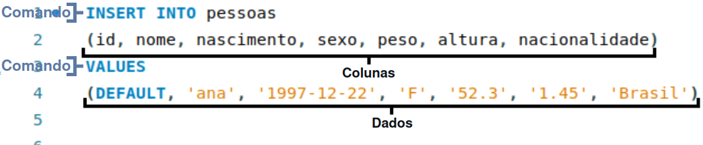

# Inserção de dados e classificação de comandos

## Inserção de dados

A inserção de dados no MySQL é bem simples. A inserção de dados funciona apartir de um comando DML (Data Manipulation Language ou Linguagem de Manipulação de Dados) é o tipo de comando que é utilizado para inserir, alterar ou excluir dados, o comando que veremos "INSERT" tem como objetivo inserir os dados a tabela, portanto a estrutura que vimos anteriormente é preenchida através desse comando. O comando de inserção de dados em uma tabela funciona através do Insert:

Nesse exemplo observamos a estrutura que compões o comando INSERT. No exemplo podemos observar que o comando INSERT INTO referência a tabela onde será inserido os dados e logo em seguida adiciona entre parênteses as colunas onde os dados serão inseridos, em seguida vem o comando VALUE que representa entre parênteses os dados que irão ser inseridos na tabela, além disso observe que os dados tem o comando DEFAULT que serve para deixar o valor comum que a coluna segue. Dentro do comando á também a possibilidade de seguir a ordem da tabela, isso permite ao descarte da referênciação das colunas.

## Classificações de comandos/estruturas

A classificação dos comandos através de siglas é bem comum em uma estrutura SQL. A classificação dos comandos através de termos ajuda a compreender oque cada comando pode realizar, isso separa e deixa mais simples a dinâmica do banco de dados, essas classificações funcionão através de termos como DDL, DML, DQL entre outros. Esses termos são utilizados para definir a função de cada comando, por exemplo o DDL é todo comando que cria, altera ou exclui estruturas.
 
- DDL | Data Definition Language: Os comandos DDL são aqueles comandos que cria, altera ou exclui uma estrutura. Esses comandos DDL são compostos por CREATE, ALTER, DROP e TRUNCATE, todos esses comandos manipulam estruturas (somente estruturas não dados);

- DML | Data Manipulation Language: Os comandos DML manipulam dados. Todo comando que pode manipular e interagir com informações guardadas no banco são DML, são compostos por INSERT, UPDATE e DELETE;

- DQL | Data Query Language: O comando DQL é aquele comando que é focado apenas em consulta. O DQL é focado apenas na visualização dos dados, é composto apenas pelo SELECT;

- DCL | Data Control Language: Os comandos DCL são responsavéis pela segurança e permissão. Os comandos DCL são comandos que concedem permissão ao usuário do banco de dados, são compostos por GRANT e REVOKE;

- DTL/TCL | Data/Transaction Control Language: Os comandos DTL ou TCL são comandos que gerenciam transações. Comandos DTL garante que um comando seja executado com sucesso ou totalmente cancelado em caso de erro, é composto por comandos como COMMIT, ROLLBACK e SAVEPOINT.