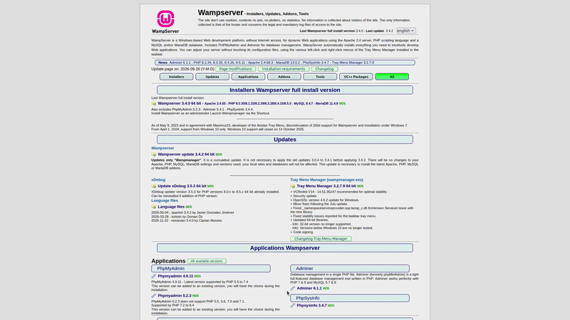
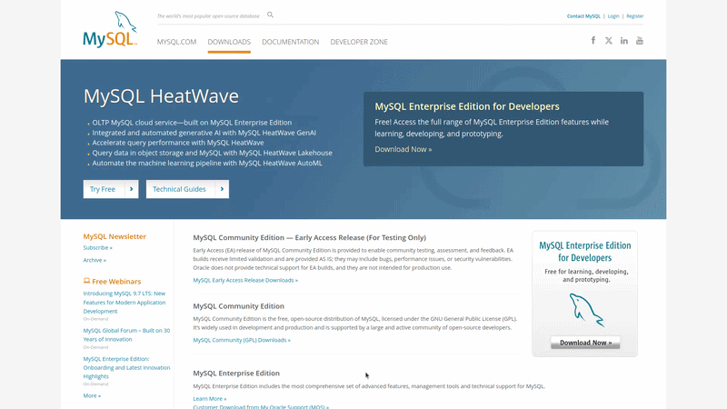

# Introdução ao MySQL

## História do MySQL

Em 1995 na Suecia o modelo de banco de dados relacional MySQL surgiu, através de dois programadores Michael Windenius e David Axmark. Em 1994 Michael Windenius e David Axmark decidiram criar um modelo de banco de dados gratuito que fosse baseado no modelo relacional, através dessa ideia os dois programadores se juntaram e partiram na criação de um modelo livre, mais pra frente em 1995 o modelo foi lançado oficialmente e 5 anos depois foi registrado como GPL (GNU General Public License), ou seja com uma licença livre, oque possibilita na alteração do código fonte a comunidade. 

Com o tempo o MySQL foi se consolidando e foi considerado um dos maiores modelos de banco de dados, com seu sucesso o modelo foi comprado pela Sun microsystems em 2007 (empresa onde nasceu a linguagem Java), depois de algumas alterações no serviço trazendo uma opção paga mais mantendo a ideologia de software livre a empresa Sun microsystems foi comprada pela Oracle em 2009.

## O que é MySQL

O MySQL é um sistema de gereciamento de banco de dados relacional de código aberto que utiliza a linguagem SQL para armazenar e organizar os dados. A ferramenta MySQL possibilita criação de banco de dados relacionais atráves de interface gráfica como o MySQL Workbench, extenções de código como o MySQL Shell for VS Code e na linha de comando clássica. Resumindo o MySQL é um conjunto de ferramentas que utiliza a linguagem SQL e possibilitam o gerenciamento de bancos de dados e o armazenamento dos dados atráves de um servidor MySQL server.

## Instalação do Ambiente

A preparação do ambiente para executar o MySQL é bem simples e consiste no pacote que conecta o MySQL no PHP e a interface gráfica responsável por executar os comandos SQL. O pacote utilizado como exemplo será o WampServer que será responsável por transformar o sistema operacional Windows em um servidor web local para conectar o PHP e o MySQL, e também utilizaremos o MySQL Workbench que é a interface gráfica oficial do MySQL, responsável por executar a linguagem MySQL no banco de dados. Em resumo a instalação se resume a WampServer e MySQL Workbench, para um sistema Linux basta utilizar no lugar do WampServer o XAMPP;

- WampServer: Para instalação do WampServer basta acessar o site [wampServer.com](https://wampserver.aviatechno.net/);
    
    1. Entre no site e se direcione a aba "Installers";
    2. Dentro da aba "Installer" clique no link marcado de azul escuro.

        

- MySQL Workbench: Para instalar o MySQL Workbench basta entrar no site [mysql.com](https://www.mysql.com);

    1. Dentro do site clique na aba "MYSQL.COM";
    2. Dentro da aba se direcione ao link em laranja "MySQL Enterprise Edition";
    3. Dentro do link no canto esquedo vá até a opção "Workbech";
    4. Dentro da opção vá até o link escrito "Download the latest MySQl Workbench";
    5. Por fim escolha o sistema Windows e efetue o Dowload.

        

    