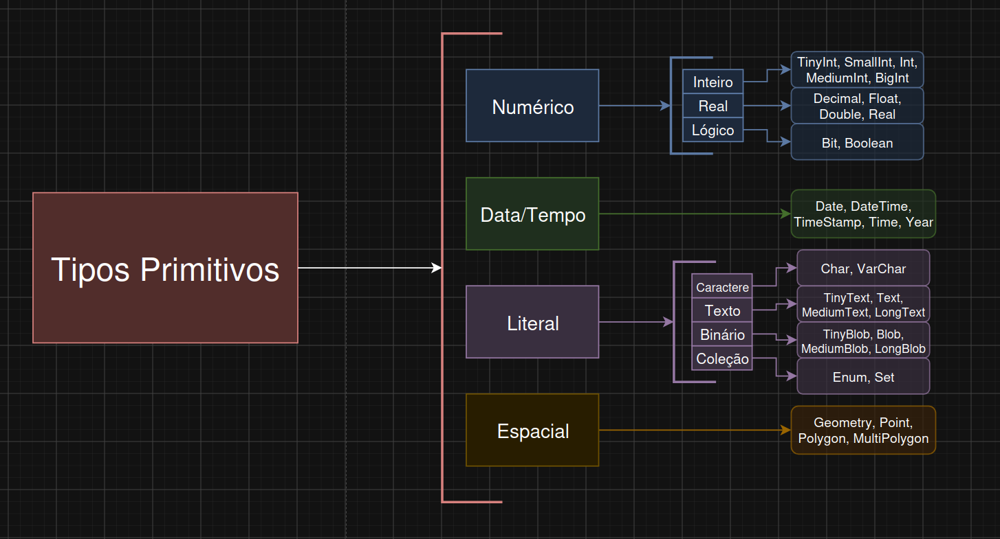
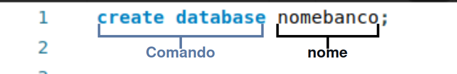
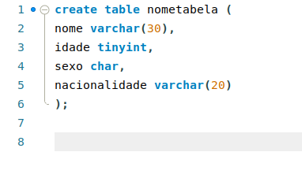

# Primeiros Passos

## Estrutura de um Banco de Dados

Para compreendermos os comandos e como iremos aplicalos, primeiramente devemos compreender a estrutura de um banco de dados. A estrutura de um banco de dados usando como exemplo gráfico o mySQL é básicamente `Banco > Tabelas > Colunas`, os bancos são compostos por tabelas e as tabelas são compostas por colunas com dados específicos. Resumindo os três pilares principais são banco, tabela e coluna, é isso que vai reger o fluxo dos dados e dentre eles iram aver opções destintas para esses dados.

## Tipos Primitivos

Os tipos primitivos são tipos de dados que são definidos na criação de uma tabela. Os tipos primitivos são tipos que ditam quais formatos de dados uma coluna pode carregar, por exemplo a coluna "nome" pode carregar TEXT que é um tipo primitivo, ou seja ao receber um dado na coluna "nome" esse dado apartir da criação foi definito como TEXT por tanto o dado na coluna será do tipo texto. Esses tipos primitivos são organizados por famílias, essas famílias definem o tipo de dado que está sendo imposto a quela coluna.

Como vemos no exemplo, os tipos primitivos são organizados em famílias, sendo eles associados ao tipo de dado presente na coluna. Concluindo, os tipos primitivos são básicamente comandos que ao criar uma tabela estabelecem um tipo de dado a quela coluna, o termo mais adequado para tipos primitivos (referência as linguagens de programação) seria tipos de dados.

## Comandos iniciais

Os comandos inicias que são os comandos base, estão relacionados ao comando de criação de banco e criação de tabela. Os comandos de criação de banco e tabela, inicialmente são extremamente simples, utilizando um vocabulo bem simples os comandos são linhas de códigos SQL executados através do workbench pela interface gráfica no botão de raio. Para simplificar a ideia vejamos alguns exemplos:

Como vemos no exemplo o comando de criação consiste no comando e no nome do banco. Os comandos SQL costumam ser compostos por comando e nome, outro exemplo que vale apena exemplificar é o comando de criação de tabelas:

Para finalizar os comandos base iremos analisar a criação de tabelas de forma mais profunda. Na criação de tabelas percebesse três principais caracteristicas do SQL, primeiramente como referência, podemos utilizar como forma de exemplificação que os comandos do exemplo estam em azul e os nomes então em preto, cada comando apartir do lado de dentro dos parênteses "()" são tipos primitivos/tipos de dados, é assim que a estrutura de um comando no mySQL se parece, para finalizar, podemos notar que a separação entre fim de uma coluna para a outra é a vírgula "," e o final do comando é o ponto e vírgula ";". Resumindo, o comando de criação de tabelas é composto por `comando-tabela > nome-tabela > nome-coluna > tipo-dado > fechamento`.